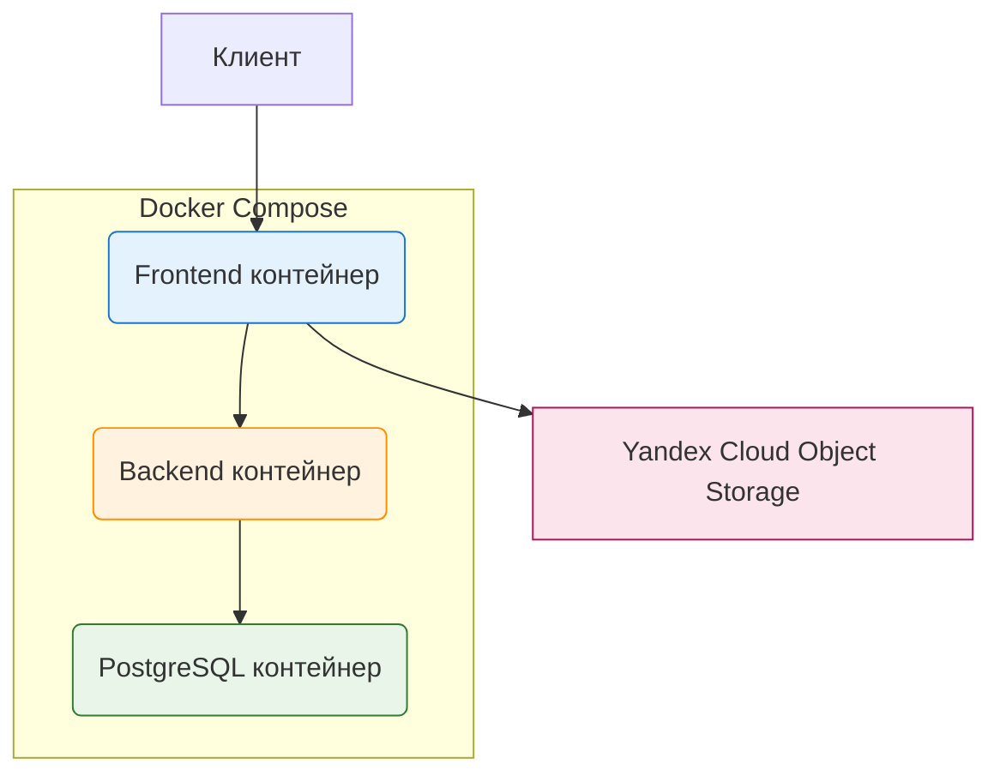

# ПСБ Learn

Проект разработан в рамках хакатона Changellenge 2025.  
Реализована полноценная LMS с поддержкой курсов, материалов (статьи, файлы), заданий и экспортом уроков в офлайн-формат.

## Архитектура проекта



## Технологический стек

| Слой            | Технология                  | Примечание                           |
| --------------- | --------------------------- | ------------------------------------ |
| Frontend        | Vue 3 + Quasar Framework    | Composition API, Vite, Pinia         |
| Редактор        | TipTap                      | WYSIWYG-редактор статей              |
| Хранилище       | Yandex Cloud Object Storage | Прямая загрузка с клиента            |
| Backend         | Java 21 + Spring Boot 3     | REST API                             |
| База данных     | PostgreSQL 16               | Полная структура курсов и материалов |
| Контейнеризация | Docker + Docker Compose     | Полная изоляция всех компонентов     |

## Требования

- Docker ≥ 20.10

Установка Node.js, JDK или других инструментов не требуется.

## Запуск проекта

```bash
git clone https://github.com/Komissarich/Changellenge_hackaton_2025
cd Changellenge_hackaton_2025
docker compose up --build
```

Приложение доступно по адресу: http://localhost:9001

## Реализованные возможности

- Регистрация и авторизация
- Создание курсов и управление материалами
- Редактор статей с поддержкой изображений
- Прямая загрузка файлов и готовых HTML-страниц в Yandex Cloud Object Storage
- Автоматический экспорт статей в самостоятельные .html-файлы
- Создание заданий для студентов
- Адаптивный интерфейс на базе Quasar Framework

## Наша команда: Три корочки

- Фирсов Артем - Backend
- Бисултанов Раджаб - Backend
- Попов Егор - Frontend
- Безрукавая Анастасия - Frontend
- Пономарев Данил - ССО

## Демонстрация работы


https://github.com/user-attachments/assets/0d80102c-e95c-404d-bb8c-e895c4513b63

